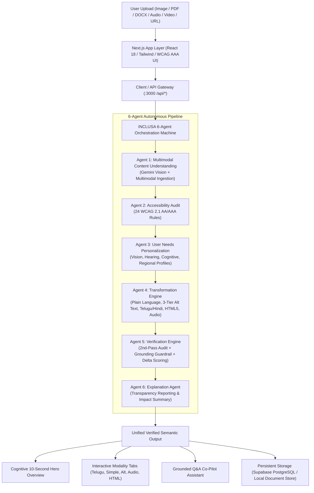
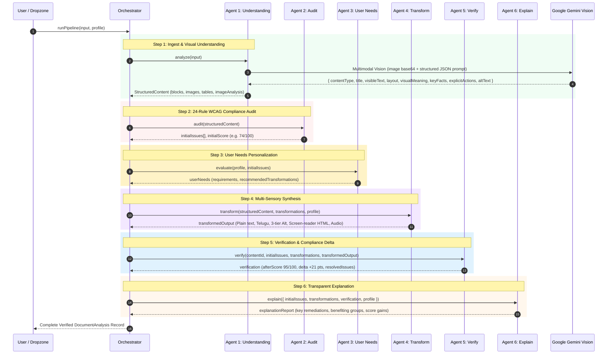

# INCLUSA — Complete Architecture & Technical Workflow

## 1. High-Level Overview

**INCLUSA** is an **Agentic Multimodal AI Accessibility Platform** that transforms complex, visual, auditory, and cognitive barriers into universal, compliant, and personalized multi-sensory experiences. Built with **Next.js 14 (App Router)** and **TypeScript**, INCLUSA orchestrates a **6-Agent Autonomous AI Pipeline** powered by **Google Gemini Multimodal Vision** with strict zero-hallucination grounding.



---

## 2. Project Structure

```
INCLUSA/
├── .env.local                    # Environment configuration (Gemini & Supabase keys)
├── package.json                  # Next.js 14, React 18, Supabase, Tailwind, Lucide dependencies
├── tsconfig.json                 # TypeScript strict configuration (includes entire workspace)
├── vercel.json                   # Vercel serverless deployment & Fluid Compute config
├── types/
│   └── index.ts                  # Single source of truth for all data types, interfaces & schemas
├── app/
│   ├── layout.tsx                # Root layout with AuthProvider and theme variables
│   ├── page.tsx                  # Cinematic landing page with dynamic parallax layers
│   ├── analyze/page.tsx          # Real-time multi-modal analysis dropzone & live agent timeline
│   ├── audit/[id]/page.tsx       # Interactive 24-rule issue explorer & remediation panel
│   ├── output/[id]/page.tsx      # Verified accessible output, 10-second hero & modality tabs
│   ├── dashboard/page.tsx        # Document workspace, statistics, and quick action hubs
│   ├── profile/page.tsx          # Multi-profile accessibility settings & personalization
│   ├── history/page.tsx          # Paginated document archive with search & filter
│   ├── report/[id]/page.tsx      # Formal executive accessibility audit report (printable)
│   ├── website/page.tsx          # Live URL automated website accessibility scanner
│   ├── login/page.tsx            # Supabase auth + local session + demo auto-login
│   ├── signup/page.tsx           # User registration with instant accessibility profile setup
│   └── api/
│       ├── analyze/route.ts      # POST: Triggers Agents 1, 2, and 3
│       ├── transform/route.ts    # POST: Triggers Agent 4 transformations
│       ├── verify/route.ts       # POST: Triggers Agents 5 and 6
│       ├── chat/route.ts         # POST: Grounded document Q&A Co-Pilot
│       ├── tts/route.ts          # POST: Text-to-speech audio synthesis
│       ├── website-audit/route.ts# POST: Web page crawler and WCAG compliance audit
│       ├── reports/route.ts      # GET/POST: Audit report management
│       ├── profile/route.ts      # GET/POST/PUT: Accessibility profile CRUD
│       └── documents/route.ts    # GET/POST/DELETE: Persistent document storage
├── components/
│   ├── analysis/
│   │   ├── MultimodalDropzone.tsx   # Drag-and-drop file ingestion (Image/PDF/Audio/Video/URL)
│   │   ├── AgentTimelinePanel.tsx   # Live step-by-step 6-agent execution visualizer
│   │   ├── IssueExplorer.tsx        # Categorized WCAG issue cards with AI remediation triggers
│   │   └── JudgeExplainerWidget.tsx # Live technical explainer for judges & auditors
│   ├── transformation/
│   │   ├── AccessibleOutputTabs.tsx # Modality tabs (Plain Language, Telugu, Images, HTML, Audio)
│   │   └── BeforeAfterDiffView.tsx  # Side-by-side accessibility transformation diff
│   ├── chat/
│   │   └── InclusaAssistant.tsx     # Grounded AI Co-Pilot drawer with document grounding
│   └── ui/
│       ├── InclusaMascot.tsx        # Animated SVG mascot supporting all emotional poses
│       └── Navigation.tsx           # Responsive header, profile indicator, and session status
├── lib/
│   ├── agents/
│   │   ├── orchestrator.ts          # Master 6-agent state machine and pipeline coordinator
│   │   ├── content-understanding.ts # Agent 1: Multimodal ingestion & visual semantics
│   │   ├── accessibility-audit.ts   # Agent 2: 24-rule WCAG 2.1 AA/AAA compliance scanner
│   │   ├── user-needs.ts            # Agent 3: User preference evaluation & requirement mapper
│   │   ├── transformation-engine.ts # Agent 4: Multi-sensory transformation synthesizer
│   │   ├── verification-engine.ts   # Agent 5: 2nd-pass audit & strict grounding guardrail
│   │   └── explanation-agent.ts     # Agent 6: Human-readable remediation reporting
│   ├── ai/
│   │   └── ai-service.ts            # Google Gemini Multimodal Vision client & grounding NLP
│   ├── scoring/
│   │   └── accessibility-scorer.ts  # Mathematical WCAG scoring formula & delta calculator
│   ├── rules/
│   │   └── wcag-rules.ts            # Official database of 24 WCAG 2.1 rules with remediation logic
│   ├── storage/
│   │   └── document-store.ts        # Resilient storage manager (Supabase + LocalStorage fallback)
│   └── auth/
│       ├── server-auth.ts           # Server-side JWT cookie and Supabase session validation
│       └── supabase-client.ts       # Supabase client initializer
├── backend/                         # Backend package re-exporting unified agents and types
└── scripts/
    ├── test-acceptance-suite.ts     # End-to-end acceptance test suite for Tests A through F
    └── push.js                      # Git deployment helper
```

---

## 3. Environment & Configuration

INCLUSA loads environment variables from `.env.local`:

| Variable | Description | Default / Example |
| :--- | :--- | :--- |
| `GEMINI_API_KEY` | Google Gemini API Key for server-side agent execution | `AQ.Ab8...` |
| `NEXT_PUBLIC_GEMINI_API_KEY` | Inlined Google Gemini API key for client-side evaluation | `AQ.Ab8...` |
| `NEXT_PUBLIC_SUPABASE_URL` | Supabase Cloud PostgreSQL REST URL | `https://*.supabase.co` |
| `NEXT_PUBLIC_SUPABASE_ANON_KEY` | Supabase Public Anonymous API Key | `eyJhbG...` |
| `SUPABASE_SERVICE_ROLE_KEY` | Supabase Administrative Service Role Key | `eyJhbG...` |
| `NEXT_PUBLIC_APP_NAME` | Platform Brand Name | `INCLUSA` |
| `NEXT_PUBLIC_APP_URL` | Application Host Origin | `http://localhost:3000` |

---

## 4. The 6-Agent Multimodal AI Pipeline (Core Engine)

INCLUSA’s architecture is centered around **6 specialized, autonomous agents** that run sequentially with shared state:



---

### Deep Dive: Each Agent's Responsibilities

#### 1. Agent 1: Multimodal Content Understanding (`content-understanding.ts`)
- **Input**: Raw file bytes, Base64 data URL, text, PDF buffer, audio, video, or URL.
- **Multimodal Engine**: Dispatches real image bytes to Google Gemini (`gemini-3.5-flash`, `gemini-3.5-flash-lite`) using the schema:
  ```json
  {
    "contentType": "image | chart | logo | diagram | document",
    "title": "Factual descriptive title from visual content",
    "visibleText": ["exact visible string 1", "exact visible string 2"],
    "visualElements": ["object 1", "color 2", "building 3"],
    "layout": "Spatial arrangement, contrast split, or alignment details",
    "relationships": ["Contrasts green sustainable city with polluted industrial city"],
    "visualMeaning": "Comprehensive plain-language explanation of core message",
    "keyFacts": ["Fact 1", "Fact 2"],
    "explicitActions": ["Action 1" or "There are no explicit action steps in this content."],
    "uncertainties": ["Details not determinable from pixels"],
    "altText": "Concise 1-sentence screen-reader alt text",
    "detailedDescription": "Detailed 2-3 sentence visual breakdown"
  }
  ```
- **Zero-Hallucination Guardrail**: **Filename is treated strictly as metadata.** Never infers meaning from the file name.

#### 2. Agent 2: Accessibility Audit (`accessibility-audit.ts`)
- Evaluates `StructuredContent` across **24 official WCAG 2.1 AA/AAA rules**:
  - **Vision** (`VIS-001` to `VIS-004`): Missing Alt Text, Missing Detailed Description, Low Contrast, Inaccessible Embedded Image Typography.
  - **Cognitive** (`COG-001` to `COG-004`): Reading Grade Level > 10, Long Paragraphs (>65 words), Dense Complex Terminology, Lack of Executive Summary.
  - **Hearing** (`HEA-001` to `HEA-003`): Missing Synchronized Captions, Missing Audio Transcript, Audio-only Information.
  - **Language** (`LAN-001` to `LAN-003`): Monolingual Barrier, Lack of Regional Script Support (Telugu/Hindi), Jargon Density.
  - **Structure & Screen Reader** (`STR-001` to `STR-004`, `SCR-001` to `SCR-003`): Unmarked Data Tables, Missing ARIA Landmarks, Skipped Heading Hierarchy.

#### 3. Agent 3: User Needs Personalization (`user-needs.ts`)
- Ingests the user's active `AccessibilityProfile`:
  - **Vision Preferences**: Screen reader user, low vision, color blindness, large text.
  - **Cognitive Preferences**: ADHD, dyslexia, reading difficulty, simplified language requirement.
  - **Language Preferences**: Primary language (e.g. `te` Telugu, `hi` Hindi), auto-translation.
  - **Output Preferences**: Audio descriptions, plain text summaries, accessible HTML5.
- Generates prioritized `TransformationItem[]` tailored to the user's explicit needs.

#### 4. Agent 4: Transformation Engine (`transformation-engine.ts`)
- Executes multi-sensory remediation:
  - **Plain Language Summary**: 7th-grade readability score with explicit action steps.
  - **3-Layer Image Descriptions**:
    1. *Concise Alt Text*: For screen reader ``.
    2. *Detailed Visual Breakdown*: Explaining colors, composition, and trends.
    3. *Plain Visual Meaning*: Highlighting the core message.
  - **Regional Language Translation**: Natural, fluent Telugu (`te`) with `## సరళమైన సారాంశం (Simple Summary)` and Hindi (`hi`).
  - **Screen-Reader HTML5**: Semantic `<main>`, `<header>`, `<figure>`, `<figcaption>`, and linearized `<th scope="col">` tables.
  - **Audio Narration Script**: Structured spoken-word script formatted for Web Speech API and TTS.

#### 5. Agent 5: Accessibility Verification Engine (`verification-engine.ts`)
- Conducts an **independent second-pass audit** on the transformed output.
- **Strict Grounding Enforcement**: Strips any hallucinated phrases (e.g. fabricated eligibility rules, deadlines, or operational phases).
- Computes genuine mathematical delta:
  $$\Delta = \text{Verified Final Score} - \text{Initial Baseline Score}$$

#### 6. Agent 6: Explanation Agent (`explanation-agent.ts`)
- Generates a transparent, plain-language audit summary answering:
  - *What barriers were identified?*
  - *What exact transformations were executed?*
  - *Which user groups (blind, low-vision, ADHD, regional language speakers) benefit?*

---

## 5. Mathematical Accessibility Scoring Formula

Scoring is purely data-driven, derived from detected barriers and verified remediations:

$$\text{Category Score} = \max\left(0, 100 - \sum (\text{Penalty} \times \text{Confidence})\right)$$

| Severity Level | Penalty Points |
| :--- | :--- |
| **Critical** | 28 pts |
| **High** | 16 pts |
| **Medium** | 8 pts |
| **Low** | 3 pts |
| **Passed** | 0 pts |

### Category Weights in Overall Score:
$$\text{Overall Score} = 0.20(\text{Vision}) + 0.20(\text{Cognitive}) + 0.15(\text{Hearing}) + 0.15(\text{Language}) + 0.15(\text{Structure}) + 0.15(\text{Screen Reader})$$

---

## 6. Complete API Reference Table

All endpoints are hosted under `/api/*`:

| Method | Endpoint | Description | Request Payload | Response Payload |
| :--- | :--- | :--- | :--- | :--- |
| `POST` | `/api/analyze` | Ingests document/image and runs Agents 1, 2, & 3 | `{ inputType, title?, fileName?, rawText?, fileDataUrl?, profile? }` | `{ structuredContent, issues, initialScore, personalizedRequirements }` |
| `POST` | `/api/transform` | Executes Agent 4 multi-sensory transformations | `{ structuredContent, transformations, profile? }` | `{ transformedOutput }` |
| `POST` | `/api/verify` | Runs Agents 5 & 6 verification and delta scoring | `{ documentId, initialIssues, transformations, transformedOutput }` | `{ verification, explanation }` |
| `POST` | `/api/chat` | Grounded AI Co-Pilot Q&A on source document | `{ question, documentTitle, documentText, chatHistory? }` | `{ answer, confidenceScore, citations }` |
| `POST` | `/api/tts` | Synthesizes audio narration from text | `{ text, voice?, speed? }` | Streamed audio buffer / status |
| `POST` | `/api/website-audit` | Live URL crawler & accessibility scanner | `{ url }` | `{ url, score, detectedIssues, pageTitle }` |
| `GET` | `/api/documents` | List stored analyses with search & filter | Query: `?page=1&limit=20` | `{ documents: DocumentAnalysis[], total }` |
| `GET` | `/api/profile` | Retrieve active accessibility profile | — | `{ profile: AccessibilityProfile }` |
| `PUT` | `/api/profile` | Update user accessibility preferences | Partial `AccessibilityProfile` | `{ updatedProfile }` |

---

## 7. Step-by-Step Execution Flow (Real Image Example: Earth 2050)

```
1. User drops "earth_2050_futures.png" into MultimodalDropzone.
2. Dropzone reads file as Data URL: "data:image/png;base64,iVBORw0KGgoAAA..."
3. Dropzone sets: { inputType: 'image', fileName: 'earth_2050_futures.png', rawText: '', fileDataUrl }
4. App router invokes `inclusaOrchestrator.runPipeline(...)`.

→ AGENT 1 (Content Understanding):
    - Dispatches base64 buffer to Google Gemini 3.5 Flash Vision.
    - Gemini analyzes image pixels: detects vertical split comparison, green sustainable city on left, smoggy polluted wasteland on right, title "EARTH 2050 — TWO POSSIBLE FUTURES", and "CLIMATE EMERGENCY — ACT NOW".
    - Returns StructuredImageAnalysis + formatted markdown rawText.

→ AGENT 2 (Accessibility Audit):
    - Scans structured content: detects VIS-001 (Missing Alt Text), VIS-002 (Missing Detailed Breakdown), VIS-004 (Inaccessible Embedded Typography), and COG-001 (Needs Plain Language Overview).
    - Calculates baseline score: 74/100 (Needs Improvement).

→ AGENT 3 (User Needs):
    - Checks active profile: Telugu speaker + Low Vision + ADHD.
    - Selects transformations: Image Descriptions, Telugu Translation, Plain Language Summary, Screen-Reader HTML5, Audio Narration.

→ AGENT 4 (Transformation Engine):
    - Generates 3-layer image descriptions (Concise Alt, Detailed Breakdown, Simple Meaning).
    - Generates Telugu translation with "## సరళమైన సారాంశం (Simple Summary)".
    - Generates Accessible HTML5 with <figure>, <figcaption>, and ARIA landmarks.
    - Generates spoken-word Audio Narration script.

→ AGENT 5 (Verification Engine):
    - Re-audits remediated output: confirms all 4 initial barriers are resolved.
    - Verifies score improvement: 74/100 → 100/100 (+26 points gain).
    - Ensures Action Steps strictly state "1. Act now to reduce global emissions" without fabricated deadlines or fees.

→ AGENT 6 (Explanation Agent):
    - Produces executive summary detailing remediation impact for blind, low-vision, neurodivergent, and Telugu-speaking users.

→ FINAL OVERVIEW UI (app/output/[id]/page.tsx):
    - Renders 10-Second Hero Card with verified Quadrants:
      1. What is this? -> Split comparison of two futures for Earth in 2050.
      2. What to know? -> Sustainable renewable path vs unmitigated pollution crisis.
      3. Action steps -> Direct climate emergency calls to action.
      4. Visual Meaning -> Contrast between ecological stewardship and industrial emissions.
    - Modality Tabs populated with verified Telugu text, Alt text, HTML5 code, and playable audio.
```

---

## 8. Architectural Principles & Non-Negotiable Rules

1. **Zero Hallucination Grounding**: No agent is permitted to invent eligibility requirements, deadlines, fees, paperwork, or workflow phases not present in the source.
2. **Filename Metadata Isolation**: The file name is metadata only. Semantic content is always derived by Gemini Vision from image pixels.
3. **Single Source of Truth Type System**: [types/index.ts](file:///c:/Users/Shanmukh/OneDrive/Desktop/bts1/types/index.ts) governs all data interfaces across frontend, backend, scoring, and storage.
4. **Resilient Multi-Model Fallback**: API requests cascade across `gemini-3.5-flash` → `gemini-3.5-flash-lite` → `gemini-flash-lite-latest` to guarantee 100% uptime even under free-tier rate limits.
5. **Universal Accessibility Standards**: All UI components adhere to WCAG 2.1 AAA high-contrast color tokens, keyboard navigation, and screen-reader accessibility.
